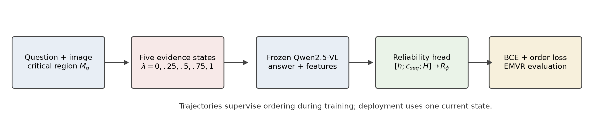
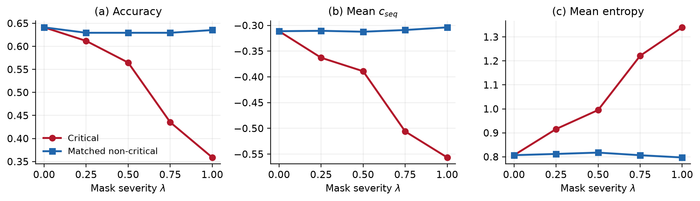

# Evidence-Order Calibration for Selective Visual Reasoning

> Does VLM confidence track visual evidence? Selective reasoning under controlled evidence loss.

This repository studies answer-level reliability as question-critical visual evidence is progressively removed. A frozen Qwen2.5-VL-3B-Instruct model generates answers and features; only lightweight post-hoc reliability heads are trained.

## Motivation

If less evidence is available for answering a particular question, a reliability estimate should generally not increase. For five evidence states,

\[
R_0 \ge R_{0.25} \ge R_{0.5} \ge R_{0.75} \ge R_1.
\]

We measure violations of this order with the Evidence Monotonicity Violation Rate (EMVR): the fraction of adjacent severity pairs where reliability rises after more critical evidence is removed. EMVR is a task-specific behavioral diagnostic, not a universal uncertainty metric.

## Main finding

- Native confidence responds to critical masking in aggregate, but its trajectory-level EMVR is **0.436** and 92.0% of trajectories contain a violation.
- A BCE-only reliability head reaches EMVR **0.330**; adding evidence-order supervision reduces it to **0.303**.
- The paired order-minus-BCE masking difference is **-0.027**, 95% CI **[-0.044, -0.010]**.
- When trained on masks and tested on unseen local blur, the difference is **-0.0468**, 95% CI **[-0.0739, -0.0199]**.
- This is a structural-order improvement, not generic confidence superiority: native confidence retains the best masking AURC (**0.265** versus **0.315–0.316** for learned heads).

## Method

The post-hoc head is

\[
R_\phi=\sigma\!\left(w^\top[h;c_{seq};H]+b\right),
\]

where `h` is a frozen final-layer representation, `c_seq` is semantic-token sequence log-confidence, and `H` is mean predictive entropy. Training combines answer-correctness BCE with an all-pairs evidence-order hinge loss. The frozen settings are `mu=0.3`, `margin=0.05`, `L2=1.0`, and `seed=42`.



At deployment, the trained head uses one current image/question/answer state. Full five-step trajectories are required only for supervision and evaluation.

## Experimental pipeline

```text
GQA balanced validation + scene graphs
  -> question-critical object box
  -> five local evidence severities
  -> frozen Qwen2.5-VL answers and features
  -> BCE or BCE+order reliability head
  -> correctness, calibration, EMVR, and risk-coverage evaluation
```

The frozen benchmark contains 176 accepted trajectories and 880 masking conditions. The initial 250 candidates were screened by automated visual quality control (176 accepted, 71 rejected, 3 unsure) with a limited ten-example human spot-check. It was not fully manually audited.

## Results

### Primary critical-masking comparison

| Score/model | AUROC ↑ | Brier ↓ | EMVR ↓ | Trajectory violation ↓ | AURC ↓ |
|---|---:|---:|---:|---:|---:|
| Native confidence | **0.7689** | — | 0.4361 | — | **0.2654** |
| BCE-only | 0.6743 | 0.2268 | 0.3298 | 0.8127 | 0.3151 |
| BCE + order | 0.6762 | **0.2256** | **0.3027** | **0.7673** | 0.3158 |

The EMVR reduction relative to BCE-only is statistically supported. AUROC and AURC differences between learned heads are not.

### Matched non-critical control

On 170 geometrically valid paired controls, full critical masking reduces accuracy from 0.641 to 0.359, whereas full equally sized non-critical masking changes it from 0.641 to 0.635. The paired accuracy-drop difference is **0.276**, 95% CI **[0.200, 0.347]**.

Control boxes are called *matched non-critical regions*, not pure background: only 32/170 avoid all annotated non-critical objects, and dense/nested scene-graph boxes produce a mean overlap score of 0.816.



### Held-out blur transfer

The blur operator is local to the critical box. Heads are trained on mask trajectories only and evaluated on blur trajectories for held-out question IDs.

| Score/model | AUROC ↑ | Brier ↓ | EMVR ↓ | Trajectory violation ↓ |
|---|---:|---:|---:|---:|
| Native confidence | **0.7010** | — | 0.4207 | 0.8921 |
| BCE-only | 0.6049 | 0.3521 | 0.4492 | 0.9089 |
| BCE + order | 0.6205 | **0.3383** | **0.4022** | **0.8863** |

The paired EMVR difference is supported; AUROC, Brier, and AURC intervals cross zero.

## Ablations

P20 feature ablations show that confidence-only features remain strong for correctness discrimination. Hidden states alone are not naturally monotonic under transfer: hidden-only blur EMVR is 0.456. The full hidden-plus-signals representation with BCE+order obtains the best ablation transfer EMVR, 0.391, supporting a role for the training objective.

P20 ablations are diagnostic and do not replace the frozen primary P7/P19 results.

## Limitations

- 176 accepted trajectories from a GQA-derived subset and one primary VLM.
- Automated visual QC with only a limited human spot-check.
- Scene-graph object boxes are proxies for complete question evidence.
- Strict normalized exact-answer matching; no semantic-equivalence correction.
- One strongly tested held-out degradation family (local blur).
- No selective-risk improvement over native confidence.
- Learned-head AUROC/Brier improvements are statistically inconclusive.
- Some matched non-critical boxes overlap annotated non-critical objects.
- P17 corrected stale category labels; category-specific work must use the corrected taxonomy.

## Reproducing results

Create an environment and install the recorded dependencies:

```powershell
py -3.14 -m venv .venv
.venv\Scripts\python.exe -m pip install -r requirements.txt
```

### A. Cached-output workflow (recommended)

No VLM inference is needed to regenerate paper-facing consolidation and figures:

```powershell
.venv\Scripts\python.exe scripts/p20c_consolidate_results.py
.venv\Scripts\python.exe scripts/paper/generate_paper_figures.py
.venv\Scripts\python.exe scripts/paper/validate_paper_results.py
Set-Location paper
pdflatex -interaction=nonstopmode -halt-on-error main.tex
bibtex main
pdflatex -interaction=nonstopmode -halt-on-error main.tex
pdflatex -interaction=nonstopmode -halt-on-error main.tex
```

If Perl is installed, `latexmk -pdf -interaction=nonstopmode main.tex` is an
equivalent one-command alternative.

### B. Full expensive workflow

The model inference stages are `p10_p11_run_scaled_qwen.py`, `p18b_run_irrelevant_qwen.py`, `p19b_run_blur_inference.py`, and `p19c_extract_blur_hidden.py`. They are resumable but require the GQA images/metadata and substantial compute. See [Reproducibility](docs/REPRODUCIBILITY.md) before running them; the accepted manifest is frozen and must not be regenerated or edited.

## Repository structure

```text
paper/                 LaTeX manuscript, references, tables, and figures
docs/                  reproducibility and artifact indexes
scripts/               staged experiment scripts
scripts/paper/         paper figure generation and consistency checks
results/scaled/p20/    frozen paper-facing consolidation
results/scaled/p18/    matched non-critical control
results/scaled/p19/    local-blur transfer
data/gqa/manifests/    benchmark manifests (accepted manifest is frozen)
```

See [Experiment Map](docs/EXPERIMENT_MAP.md), [Results Index](docs/RESULTS_INDEX.md), and [Script Index](docs/SCRIPT_INDEX.md).

## Development sequence

The project was developed during June--July 2026. Work progressed from frozen-model viability and signal extraction (P0--P2), through synthetic and grounded pilot trajectories (P3--P8), to scaled benchmark construction and masking experiments (P9--P16). The final stages added taxonomy cleanup (P17), matched non-critical controls (P18), held-out local-blur transfer (P19), final ablations and consolidation (P20), and paper/reproducibility polish.

## Paper

The manuscript is [Evidence-Order Calibration for Selective Visual Reasoning under Progressive Loss of Question-Critical Evidence](paper/main.pdf), by **MUHAMATHU AMEER ALI AACAAS MUHAMATH**, Department of Electrical Engineering, University of Moratuwa. This repository is a research artifact; it does not claim submission or acceptance at a venue.

## Citation

No DOI or arXiv identifier has been assigned. If you use this artifact, cite the repository title, author, and version or commit evaluated. Publication identifiers should be added only after a corresponding archival release exists.

## Acknowledgements

This work uses Qwen2.5-VL, GQA, Visual Genome annotations, Hugging Face Transformers, PyTorch, scikit-learn, NumPy, pandas, Pillow, and Matplotlib. Dataset and model use remains subject to their respective licenses and terms.
